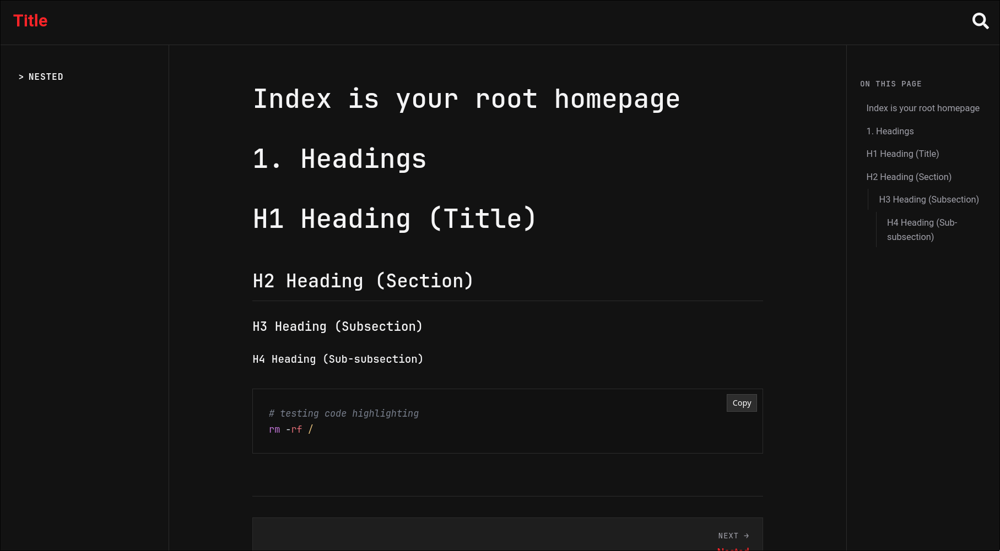
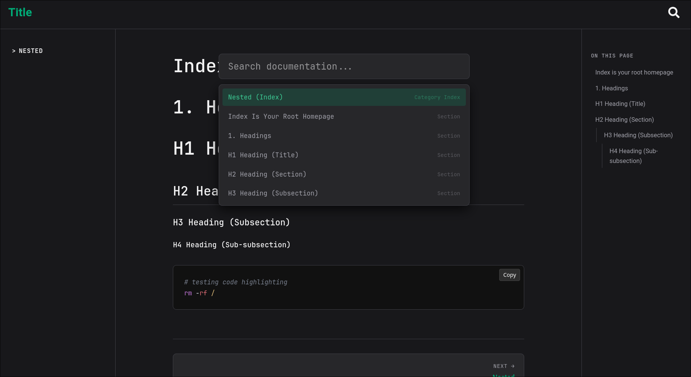
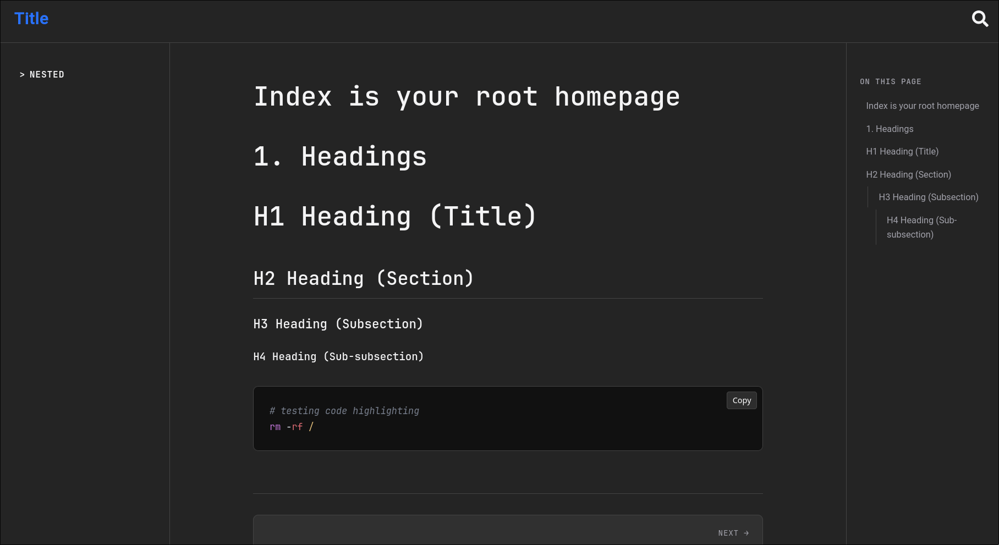
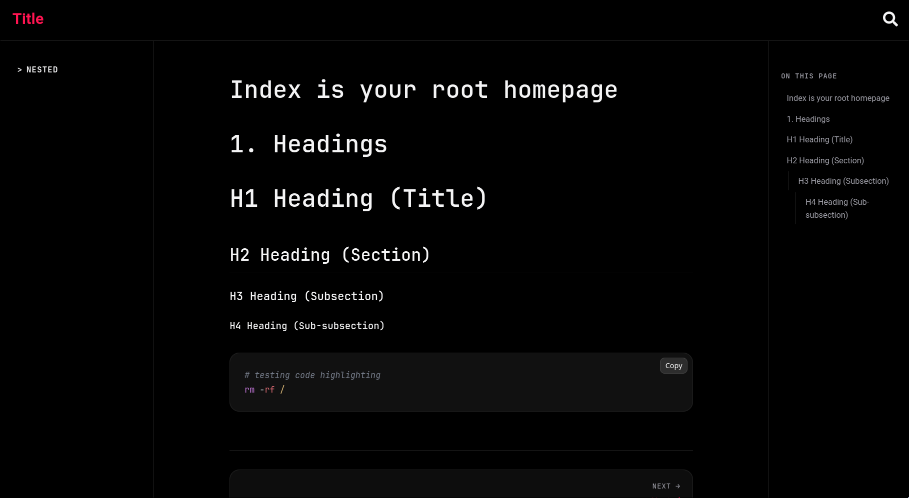
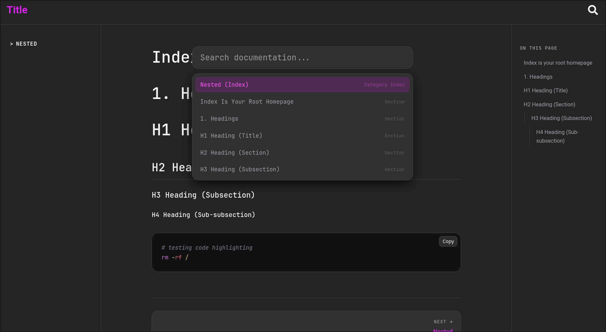
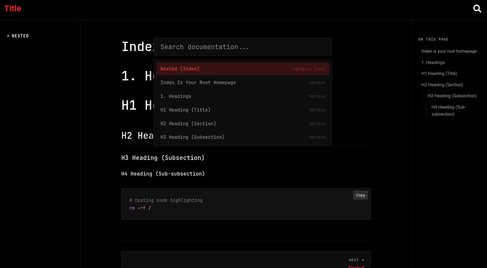
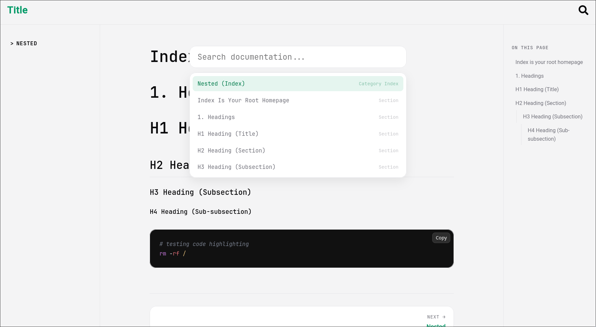
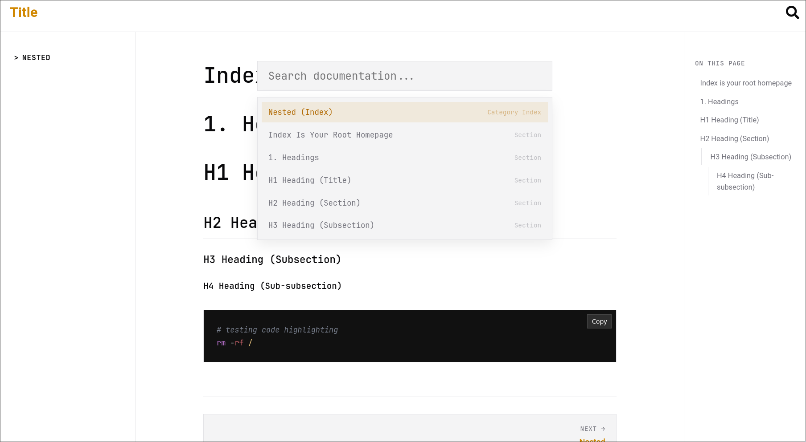
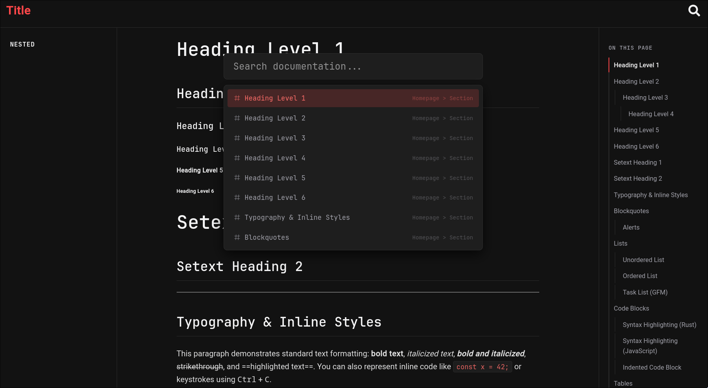

# Vault
Vault is a lightweight, blazing-fast documentation generator written in Rust. 
It automatically transforms a directory of Markdown files into a fully responsive, 
styled documentation site complete with automatic sidebar navigation, category grouping, 
syntax highlighting, and dynamic previous/next page buttons.

[](https://github.com/kyncl/vault/actions)

[](https://opensource.org/licenses/MIT)

[](https://www.rust-lang.org/)


[](https://github.com/kyncl/vault/issues)
[](https://github.com/kyncl/vault)

## Features

- **Zero-Config Structure:** Simply drop your `.md` files into a folder structure, 
and Vault handles the hierarchy, categories, and links automatically.
- **Smart Navigation:** Automatically generates Previous and Next page buttons at 
the bottom of every page with full title mapping.
- **Auto-Generated Sidebar:** Intelligently organizes files into sidebar sections 
based on your folder structure, prioritizing key files like `index` or `overview` 
(index files are turned into clickable category header).
- **File Exclusion (`vault-ignore`):** Define exactly what gets processed and what doesn't.
Using a `.vault/vault-ignore` file, which shares the exact same syntax as a standard `.gitignore`, you can easily prevent
specific drafts, private notes, templates, or entire directories from being parsed into your public HTML documentation.
- **Custom Sidebar Ordering:** Override default alphabetical sorting with `.vault/order`.
Simply list your files and folders in the order you want them displayed, top to bottom, using simple indentation
for nested category items. If you want to reset it back to original, use `vault default-order`.
- **Syntax Highlighting:** Built-in code block styling and syntax
highlighting for technical documentation.
- **Fully Customizable Styling Engine:** Change the look and feel of your docs using custom CLI:
  - **20 Color Themes:** Choose from Crimson, Orange, Emerald, Teal, Cyan, Blue, Violet, Fuchsia, Pink, and more.
  Still not enough? You can custom pick your own HEX code, which
  will be used as main theme color.
  - **Responsive Background Profiles:** Automatically adapt to system light/dark mode with options
  like **Standard**, **Comfy**, **Deep Black**, **Zen**, and more.
  - **Border-Radius Styles:** Switch between **Standard** (8px–2px gradient),
  **Brutalist** (sharp 0px edges), and **Rounded** (extra smooth 16px–4px gradient).
- **Responsive & Theme-Aware:** Mobile-friendly layout featuring a toggleable 
sidebar/burger menu and clean dark/light mode CSS variables.
- **Searching:** Search feature for users. Can be invoked by `ctrl+k` or `/`. Looks 
through current page and name of the files and their category.
- **Asset Optimization (Injected vs. Lazy):** Smart asset pipeline that handles CSS and JS files in two modes:
  - **Injected:** Bundled and embedded directly inside the HTML for maximum performance and zero extra requests.
  - **Lazy:** Linked efficiently inside the headers to load asynchronously. (Fonts are always loaded lazily).
  To make lazy file you must put `lazy__` prefix into file's name.
- **KaTeX support:** You can add mathematical expressions to
your documentation, and Vault will handle them without requiring
any runtime JavaScript. All expressions are pre-compiled.

> [!WARNING]
> This functionality may have trouble rendering advanced
> expressions on Windows builds due to the fallback JavaScript
> engine (Duktape). If you are on Windows and need full KaTeX
> feature support, it is recommended running Vault in a Docker
> container.

---

## Project Structure
While you can specify custom paths for your files, it is highly recommended 
to keep everything inside a dedicated `docs` directory.

Vault expects a clean directory structure separating your 
source Markdown files from the generated HTML output:
```text
your-project/
├── docs/
│   ├── .vault/             # Default folder for configuration files
│   │   ├── config.toml     # Configuration of your parsing settings
│   │   ├── vault-ignore    # Patterns, which should be ignored (same syntax as gitignore)
│   │   └── order           # Here lives your ordering of your sidebar
│   ├── md/                 # Your source Markdown files
│   │   └── index.md
│   └── html/               # Generated output site
│       ├── css/            # Vault's CSS files (custom styles supported)
│       ├── js/             # Vault's JS files (custom scripts supported)
│       ├── fonts/          # Custom fonts directory (@font-face required in css/)
│       └── index.html
└── ...
```

## Getting Started
### Prerequisites
- Git
- Cargo (Rust package manager)
- Make (Optional)
### Quick Run
```bash 
git clone https://github.com/kyncl/vault.git
cd vault

# For development (fast compilation)
cargo run -- parse
# For production builds (optimized performance)
cargo run --release -- parse
```
Vault will read all Markdown files, parse metadata, map sequential links, generate structured sidebars, 
inject custom CSS/JS assets, and output minified HTML files 
ready for deployment inside `docs/html`.

### Global Installation
If you want to install Vault globally on your machine:
```bash
make install
```
Once installed, you can run Vault from anywhere:
```bash
vault parse
```

## Configuration & CLI Flags
If you don't want to read through the whole thing, you can just do:
```bash
vault init
```
This will pull up CLI form, which will do the heavy lifting.

If you want to see all options, which can be set. Checkout:
```bash
vault --help
# For parsing
vault parse --help
# For the init (tbh they are kind of useless)
vault init --help
```

## Gallery

<table>
  <tr>
    <td align="center"></td>
    <td align="center"></td>
    <td align="center"></td>
  </tr>
  <tr>
    <td align="center"></td>
    <td align="center"></td>
    <td align="center"></td>
  </tr>
  <tr>
    <td align="center"></td>
    <td align="center"></td>
    <td align="center"></td>
  </tr>
  <tr>
    <td align="center"></td>
    <td align="center"></td>
    <td align="center"></td>
  </tr>
</table>

## License & Commercial Use
Distributed under the MIT License. See LICENSE for more information.
